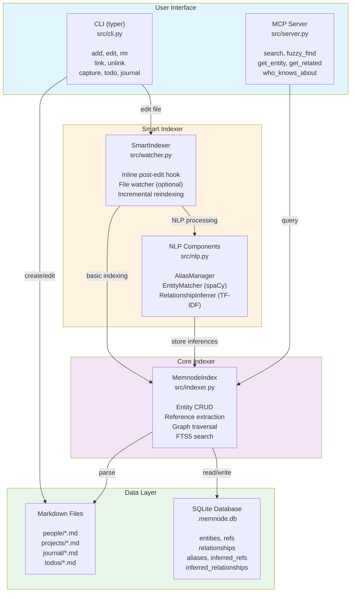
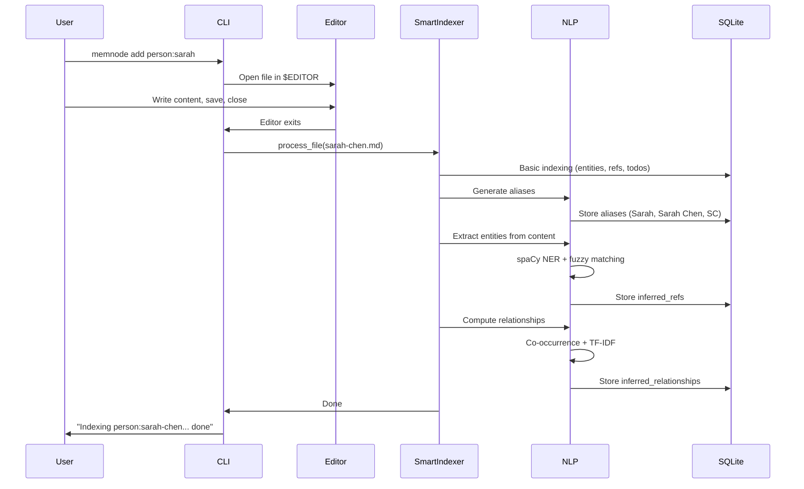
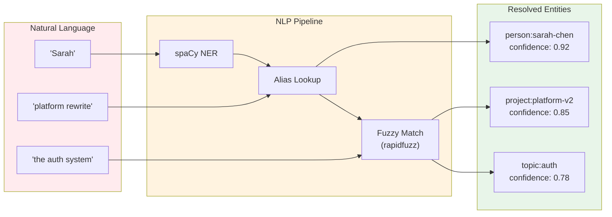
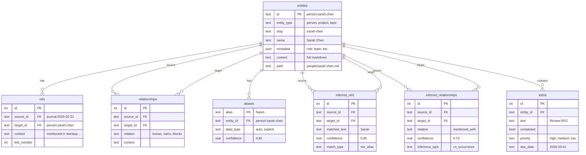

# memnode

> Personal **social graph** for engineers. Track your network, build context automatically.

memnode is a context-aware social graph where you track people, projects, and their relationships. Tag entities inline using `type:name` syntax and the graph builds itself from your notes. With **smart NLP indexing**, it understands "Sarah" means `person:sarah-chen` without you having to tag everything explicitly.

**Why "social graph" not "knowledge graph"?** You're not storing knowledge - you're storing *context about people* and their relationships to topics and projects. The knowledge lives in the people. memnode helps you find the right person to talk to.

```
┌────────────────────────────────────────────────────────────────────┐
│  You write naturally:                                              │
│                                                                    │
│    Had a meeting with Sarah about the platform rewrite.            │
│    She knows Kubernetes well. Need to sync with the                │
│    platform team about the blockers.                               │
│                                                                    │
│  memnode automatically infers:                                     │
│                                                                    │
│    "Sarah" ──► person:sarah-chen                                   │
│    "platform rewrite" ──► project:platform-v2                      │
│    "Kubernetes" ──► topic:kubernetes                               │
│    "platform team" ──► team:platform                               │
│                                                                    │
│  And builds the graph:                                             │
│                                                                    │
│    person:sarah-chen ───[mentioned_with]───► project:platform-v2   │
│           │                                         ▲              │
│           └──────[knows]──► topic:kubernetes        │              │
│                                                     │              │
│                              team:platform ─────────┘              │
└────────────────────────────────────────────────────────────────────┘
```

## Philosophy

1. **Tag, don't organize** - Just write `person:sarah` or `project:memnode` inline. No folders, no hierarchy.
2. **References ARE relationships** - Mentioning an entity in context creates a discoverable link.
3. **Smart by default** - NLP extracts entities and infers relationships automatically.
4. **Plain text, portable** - Markdown files + SQLite index. Works with any editor.
5. **AI-ready** - MCP server for intelligent synthesis ("who knows about X?", "what's blocking Y?")

## What's New: Smart Indexing

memnode now includes an intelligent indexer that runs automatically on every file edit:

- **Alias Generation**: `person:sarah-chen` becomes searchable as "Sarah", "Sarah Chen", "Sarah C"
- **Fuzzy Entity Matching**: Write "Sarah" in your notes, memnode links it to `person:sarah-chen`
- **Relationship Inference**: Entities mentioned together get automatically linked
- **Zero config**: Just use memnode normally - intelligence is built in

```bash
# Add a person, edit in your editor, close it
memnode add person:sarah-chen
# Indexing person:sarah-chen... done
# ✓ Aliases generated: "Sarah Chen", "Sarah", "Sarah C", "SC"
# ✓ Found 3 inferred references
# ✓ Computed 2 co-occurrence relationships
```

## Installation

```bash
git clone https://github.com/bashketchum02/memnode.git
cd memnode
uv sync
uv run python setup.py
```

**Optional: Enhanced NER with spaCy** (Python 3.10-3.13 only):
```bash
uv pip install spacy
uv run python -m spacy download en_core_web_sm
```

> Note: spaCy doesn't support Python 3.14+ yet. On 3.14+, memnode uses built-in regex-based NER which works well for most cases.

## Quick Start

```bash
# Initialize your notes directory
memnode init

# Add entities (opens editor, indexes on close)
memnode add person:sarah-chen
memnode add project:memnode  
memnode add topic:kubernetes

# Create explicit relationships
memnode link person:sarah topic:kubernetes --as knows
memnode link person:sarah project:memnode --as owns

# Or just write notes - relationships are auto-discovered!
memnode journal
# Write: "Talked to Sarah about the auth migration for Platform V2"
# memnode automatically links sarah-chen, auth, and platform-v2
```

## Entity Syntax

Everything is `type:slug`:

```
person:sarah-chen       # People
project:memnode         # Projects  
topic:kubernetes        # Topics/skills
team:platform           # Teams
org:acme-corp           # Organizations
decision:use-postgres   # Decisions
meeting:2025-02-21      # Meetings
```

**Pro tip**: You can still write naturally! The explicit `type:slug` syntax is for precision when you need it. For casual writing, just use names - memnode's NLP will match them.

## Writing Notes

Tag entities inline, or just write naturally:

```markdown
# Meeting Notes - Feb 21

Discussed the platform rewrite with Sarah.
She suggested involving Mike since he knows auth systems well.

Blockers:
- The API gateway project might impact our timeline
- Need approval from Acme Corp leadership

## Action Items
- [ ] Follow up with Sarah about the RFC #high @2025-03-01
- [ ] Schedule sync with the platform team
```

**What happens automatically:**
- "Sarah" → linked to `person:sarah-chen` (fuzzy match)
- "platform rewrite" → linked to `project:platform-v2` (alias match)
- "Mike" → linked to `person:mike-johnson`
- Explicit `type:slug` references create relationships (e.g., `person:sarah` in a project file → `contributes_to`)
- Co-occurrence relationships inferred (entities mentioned near each other)
- Todos extracted with their entity references

**Query later:**
- "Who is mentioned with platform-v2?" → finds Sarah, Mike
- "What does Sarah know about?" → kubernetes, auth (from co-occurrence)
- "Who contributes to platform-v2?" → finds people mentioned in project file

## CLI Commands

```bash
# Add entities (opens editor, NLP indexes on close)
memnode add person:name
memnode add project:name
memnode add topic:name

# Edit (NLP indexes on close)
memnode edit person:sarah

# Create explicit relationships  
memnode link person:sarah project:memnode --as owns
memnode link project:api project:web --as blocks

# View entities
memnode list                    # All entities
memnode list person             # All people
memnode show person:sarah       # Details + relationships + references

# Special commands
memnode capture "Quick thought"           # Add to inbox (indexes immediately)
memnode todo "Task" --priority high       # Add todo
memnode 1on1 sarah                        # Add 1:1 note (indexes on close)
memnode journal                           # Today's journal (indexes on close)

# Indexing
memnode reindex                           # Full reindex with NLP (default)
memnode reindex --no-nlp                  # Basic reindex (faster, no inference)

# Watch mode (for external editor changes)
memnode watch                             # Watch directory, index on any change
```

## MCP Server

The MCP server provides intelligent synthesis for AI agents:

```bash
# Start server (for Claude Desktop, Cursor, etc.)
memnode-server
```

### Tools

| Tool | Description |
|------|-------------|
| `search` | Full-text search across all entities |
| `fuzzy_find` | Find entity by name ("Sarah" → person:sarah-chen) |
| `get_entity` | Get entity details + relationships + inferred connections |
| `get_references` | All mentions (explicit + fuzzy-matched) |
| `get_related` | Discover related entities via co-occurrence/similarity |
| `who_knows_about` | Find people with expertise on a topic |
| `whats_on_my_plate` | Prioritized todos and blockers |
| `find_connection` | How are two entities connected? |
| `reindex` | Rebuild index with NLP processing |

### Configuration

**Claude Desktop** (`~/Library/Application Support/Claude/claude_desktop_config.json`):

```json
{
  "mcpServers": {
    "memnode": {
      "command": "uv",
      "args": ["run", "--directory", "/path/to/memnode", "python", "-m", "src.server"],
      "env": {
        "MEMNODE_DIR": "/path/to/your/notes"
      }
    }
  }
}
```

**Cursor** (`.cursor/mcp.json`):

```json
{
  "mcpServers": {
    "memnode": {
      "command": "uv",
      "args": ["run", "--directory", "/path/to/memnode", "python", "-m", "src.server"],
      "env": {
        "MEMNODE_DIR": "/path/to/your/notes"
      }
    }
  }
}
```

---

## Architecture

memnode is built as a **local-first social graph** with three layers:



### Data Flow



### Entity Resolution



### Database Schema



### How Smart Indexing Works

The **Data Flow** diagram above shows the sequence. Here's what happens at each step:

| Step | Component | What Happens |
|------|-----------|--------------|
| 1. File Saved | CLI | Editor closes after `memnode add/edit` |
| 2. Basic Indexing | `indexer.py` | Parse frontmatter, extract `type:slug` refs, parse todos, update FTS5 |
| 3. Alias Generation | `AliasManager` | "Sarah Chen" → ["Sarah Chen", "Sarah", "Sarah C", "SC"] |
| 4. Entity Extraction | `EntityMatcher` | spaCy NER + pattern matching + fuzzy matching against aliases |
| 5. Relationship Inference | `RelationshipInferrer` | Co-occurrence (nearby mentions) + TF-IDF (similar content) |
| 6. Done | CLI | "Indexing person:sarah-chen... done" |

### Why No Background Daemon?

We chose **inline post-edit hooks** over a persistent file watcher daemon:

| Approach | Pros | Cons |
|----------|------|------|
| **Inline hook** (chosen) | Simple, no setup, works everywhere | Only catches memnode CLI edits |
| Background daemon | Catches all edits (vim, VSCode, etc.) | Complex setup, resource usage |

The inline approach is sufficient because:
1. Most edits go through `memnode add/edit/journal`
2. `memnode watch` is available for power users who edit with external tools
3. `memnode reindex` can rebuild everything if needed

### NLP Stack

We use classical NLP techniques (no LLMs) to keep it fast and local:

| Component | Library | Python Version | Purpose |
|-----------|---------|----------------|---------|
| Named Entity Recognition | spaCy `en_core_web_sm` | 3.10-3.13 | Find PERSON, ORG, etc. in text |
| Named Entity Recognition | Built-in regex | 3.14+ | Fallback NER using patterns |
| Fuzzy String Matching | rapidfuzz | All | Match "Sarah" to "Sarah Chen" |
| TF-IDF Vectorization | scikit-learn | All | Document similarity |
| Pattern Matching | regex | All | Find capitalized phrases |

**Python version compatibility:**
- **3.10-3.13**: Full spaCy NER support
- **3.14+**: Uses regex-based NER (spaCy not yet compatible)

The regex-based NER catches most common patterns:
- Person names: "John Smith", "Sarah Chen"
- Organizations: "Acme Corp", "Platform V2"
- Tech terms: "PostgreSQL", "OAuth2"

**Memory footprint:**
- spaCy model: ~15MB (if installed)
- Regex NER: Zero (built-in)
- TF-IDF: Computed on-demand, not persisted
- Total overhead: Minimal, subsecond indexing per file

### Token Savings for AI Agents

The smart indexing pays off when AI agents query the graph:

**Without smart indexing:**
```
Agent: "Who should I talk to about auth?"
→ Search "auth" → 50 results
→ Agent reads all 50 documents
→ Agent figures out Sarah knows auth
→ ~10,000 tokens consumed
```

**With smart indexing:**
```
Agent: "Who should I talk to about auth?"
→ who_knows_about("auth")
→ Returns: person:sarah-chen (knows auth via co-occurrence)
→ ~200 tokens consumed
```

The graph does the work upfront so the AI doesn't have to.

---

## Directory Structure

```
~/memnode/
├── .memnode.db           # SQLite index (auto-generated)
├── .relationships.yaml   # Explicit relationships
├── people/
│   └── sarah-chen.md
├── projects/
│   └── memnode.md
├── topics/
│   └── kubernetes.md
├── teams/
│   └── platform.md
├── decisions/
│   └── use-postgres.md
├── todos/
│   └── inbox.md
└── journal/
    └── 2025-02-21.md
```

## Multi-Machine Sync

```bash
# Your notes are just files - use git
cd ~/memnode
git add -A && git commit -m "Updates" && git push

# On another machine
git pull
memnode reindex  # Rebuilds index with NLP
```

## Example Queries (via AI)

Once connected to Claude/Cursor:

- "Who knows about kubernetes?" → Uses `who_knows_about`, returns people with explicit/inferred expertise
- "Find Sarah" → Uses `fuzzy_find`, matches to `person:sarah-chen`
- "What's related to the platform project?" → Uses `get_related`, shows co-occurring entities
- "Show me everything about Sarah" → Uses `get_entity` with inferred relationships
- "How are Alice and the API project connected?" → Uses `find_connection`

## Why Social Graph?

**Knowledge graphs** store facts: `kubernetes --[is_a]--> container-orchestration`

**Social graphs** store relationships: `person:sarah --[knows]--> topic:kubernetes`

memnode is a social graph because the core question isn't "what is kubernetes?" - it's **"who should I talk to about kubernetes?"**

| Knowledge Graph | memnode (Social Graph) |
|-----------------|------------------------|
| Stores facts and concepts | Stores people and context |
| "What is X?" | "Who knows about X?" |
| Static information | Living relationships |
| Answer questions directly | Navigate to people who can answer |

The knowledge lives in your network. memnode helps you navigate it.

## Why This Approach?

| Traditional PKM | memnode |
|-----------------|---------|
| Organize into folders | Tag inline, search everything |
| Manual linking | Auto-discovered + inferred from NLP |
| Separate tools for todos/notes/people | Unified entity model |
| Complex hierarchies | Flat + graph |
| Requires explicit tagging | Understands natural language |

The `type:slug` syntax is:
- **Greppable** - `grep "person:sarah" ~/memnode/**/*.md`
- **Unambiguous** - Explicit when you need precision
- **Optional** - Write naturally, NLP handles the rest
- **AI-friendly** - Easy for LLMs to parse and reference

## Dependencies

**Core (all Python 3.10+):**
- `mcp` - Model Context Protocol server
- `typer` + `rich` - CLI interface
- `pyyaml` - YAML parsing
- `sqlite3` - Database (built-in)
- `rapidfuzz` - Fuzzy string matching
- `scikit-learn` - TF-IDF vectorization
- `watchdog` - File system monitoring

**Optional (Python 3.10-3.13):**
- `spacy` - Enhanced Named Entity Recognition (~15MB model)

## Alternatives & Comparison

### Personal CRMs

| Tool | Approach | Limitations |
|------|----------|-------------|
| **[Clay](https://clay.earth)** | Cloud CRM, auto-imports from email/LinkedIn | Subscription, cloud-only, no AI-native integration |
| **[Monica](https://monicahq.com)** | Open source personal CRM | Web app, no inline tagging, no NLP |
| **[Dex](https://getdex.com)** | Relationship manager | Cloud-only, focused on "staying in touch" not context |

### Knowledge Management

| Tool | Approach | Limitations |
|------|----------|-------------|
| **[Obsidian](https://obsidian.md)** | Markdown + bidirectional links | No typed entities, no NLP inference, no MCP |
| **[Logseq](https://logseq.com)** | Outliner + bidirectional links | Block-based, no entity model, no relationship inference |
| **[Roam Research](https://roamresearch.com)** | Bidirectional linking pioneer | Cloud-only, no entity types, expensive |
| **[Dendron](https://dendron.so)** | Hierarchical notes for devs | Hierarchy-focused (opposite philosophy) |

### AI-Native Tools

| Tool | Approach | Limitations |
|------|----------|-------------|
| **[Mem.ai](https://mem.ai)** | AI-first note-taking | Cloud-based, LLM-heavy (expensive), not social-graph focused |
| **[Reflect](https://reflect.app)** | AI-powered notes | Cloud-only, general notes, not relationship-focused |

### Feature Comparison

| Feature | Clay/Dex | Monica | Obsidian | memnode |
|---------|----------|--------|----------|---------|
| Local-first | No | Self-host | Yes | **Yes** |
| Plain markdown | No | No | Yes | **Yes** |
| Typed entities | No | Partial | No | **Yes** |
| NLP inference | No | No | No | **Yes** |
| MCP/AI-native | No | No | No | **Yes** |
| Social graph focus | Yes | Yes | No | **Yes** |
| Relationship inference | No | No | No | **Yes** |
| Open source | No | Yes | No | **Yes** |
| Free | No | Yes | Freemium | **Yes** |

### The Gap memnode Fills

- **Personal CRMs** (Clay, Monica, Dex) are cloud-based and not AI-native
- **PKM tools** (Obsidian, Roam, Logseq) don't have typed entities or social graph focus
- **AI tools** (Mem, Reflect) are cloud-only and expensive

**memnode combines:** local-first markdown + typed entities + NLP inference + MCP server + open source

The closest philosophical match is **Monica** (open source personal CRM), but memnode takes a different approach: plain markdown files, CLI-first, inline tagging, and native AI integration via MCP.

## License

MIT
